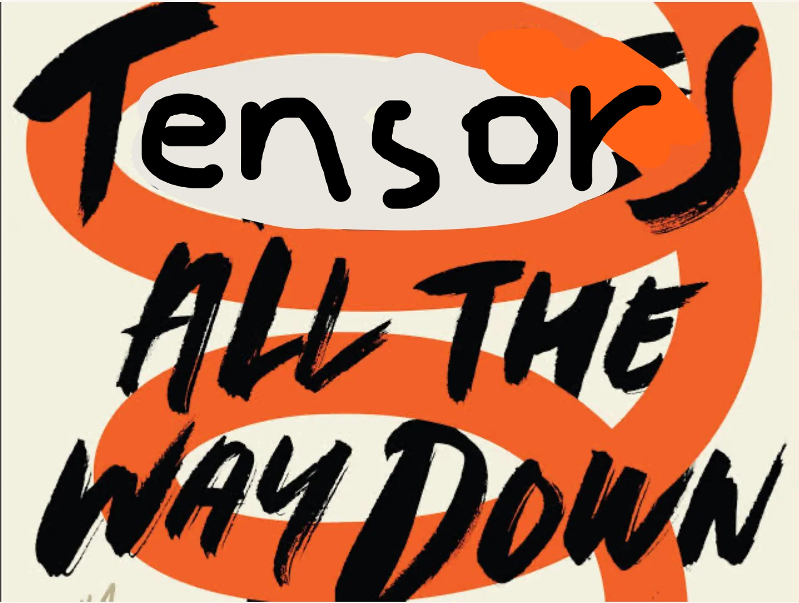

# Neural nets by hand

A fully connected MNIST classifier in raw NumPy. No PyTorch, no autograd.

Full writeup with math on my blog: [Tensors all the way down](https://aaronalvarez.me/tensors-all-the-way-down)

"Tensors all the way down" is a swap on [turtles all the way down](https://en.wikipedia.org/wiki/Turtles_all_the_way_down) — Tensors in, tensors out.